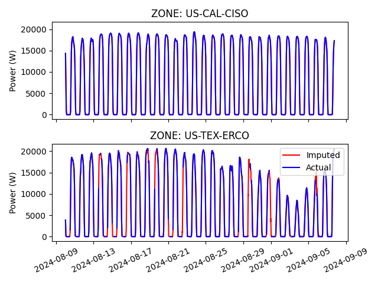
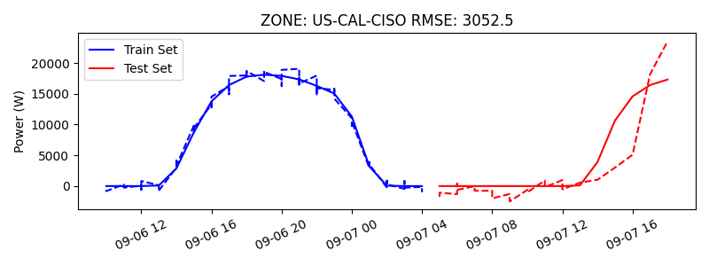
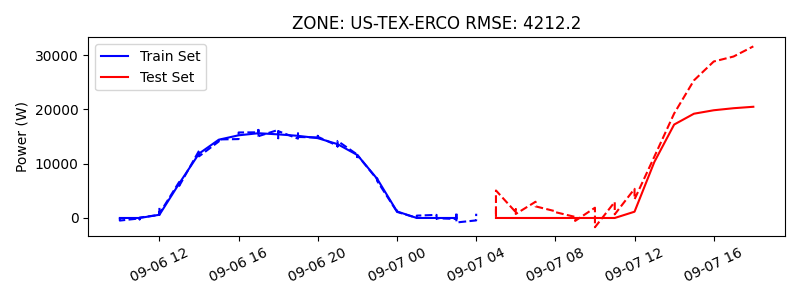

# electricity_maps_ml_challenge
My approach to solving solar power forecasting challenge from Electricity Maps under tight time constraint

## Setup

This repository describes the approach to solve the ML challenge by electricity maps.  
The goal is to forecast solar power generation in two US states using a set of pre-computed 
features obtained by running
```bash
python data/download.py
```

## EDA

The data is confidential and thus is not part of this repository.  

Data is provided in two dataframes for each State (zone, hereafter). `Feature` and `target` 
datasets share the same (mult-index) index. Featre dataframe contains a large (>1000) columns 
of weather-related features for different locations in the state. Additionally, time-related 
features as well as lags of the target are provided. 
Index here represents the data of the forecast and the hour for which the forecast is made. In 
other words, feature set represents weather forecasts made at a certain date for a certain 
number of hours from the forecasted date. The figure below shows the target for both states 
plotted as a function of the forecasted date `target_time` index. See `notebooks/eda.ipynb` for 
mode details.



The graph shows a familiar solar generation pattern: high production during the date and no generation 
during the night. Overall there is about 1 month of hourly data. 

The second panel of the graph shows a significant amount of missing data. While there are 
methods that allow to forecast with missing data (XGBoost), in this case I decided to implement 
a simple KNN imputer taking advantage of strong dependency of the target on features. Notably, 
features do not show missing values. The imputation function is developed in the same notebook. 
The result is shown with red color in the figure. 

Due to the large amount of features and small amount of time, I proceed to the forecasting 
task without more in-depth EDA. However, it is important to note that there are important 
steps that need to be performed, like correlation and auto-correlation analysis, 
determining the adequate amount of lags, removing features that show too high correlation to 
avoid multicollinearity. 

## Forecasting

In this case I am provided with a scaffolding for an MLfow project where the task is to 
implement ML model in accordance with existing infrastructure. I tried to minimize changes 
outside of the sections specifically designated for it. 

Forecasting pipeline begins with 
the data pre-processing. The class responsible for it is `SimplePreprocessor`. There I 
opted for _not to do any preprocessing_ due to time constraints. Otherwise, I would have 
implemented scaling/normalization as well as possible aggregator or PCA to reduce the number of 
features. However, I implemented a basic imputer to remove nans from data. I opted do the 
imputation inside the preprocessor instead of globally to avoid data leakage. 

Next, I implemented a class `SimpleRegressor` that inherits from `RegressorWithPredict` and 
simply calls the underlying model and performs `fit()` and `predict()`. If time allowed, 
I would have implemented also a `forecast()` function that updates lags of the target variable allowing  
to perform multi-step forecasting. The model of choice is `LinearRegression()`. While, having time 
I would have opted for `LightGBM` in this case due to a proven track record of gradient boosting 
machines in forecasting and their versatility, linear regression is much 
easier and faster to implement and requires minimum feature engineering. Otherwise, for instance, 
in the case of `XGBoost` or `LightGBM` a hyperparameter optimization with N-fold cross-validation
are needed to find a model that does not overfit and performs well. 

Finally, I implemented `SimpleTrainer()` class where I get the dataset, preprocess the data, 
train the model, and return the trained model. 

The trained model is then evaluated on the test set computing MSE and RMSE. The latter is a 
standard in point forecasts for energy generation as RMSE is sensitive to large errors. 
However, if I had more time, I would have 
explored wrapping the point forecast into a `MapieRegressor` to evaluate also the confidence 
interval of the forecast. Additionally, I would have also computed 
and saved scale-free MAPE, which is a relative measure of forecast accuracy and allows to  
compare performance for different states. 

At the end of the pipeline, the trained model & preprocessor as well as test actual and test 
predicted datasets are saved into a working directory. Having the original dataset (not saved due to 
memory considerations) and trained model, allows downstream users to instantiate and perform inference 
on the model. I initially planned to create an example of a downstream user that loads the model and 
performs inference, but I run out of time. Thus, I opted for plotting the forecast performance right 
inside the saving function which is, well, not ideal. Additionally, I did not implement any additional 
tests or serving layers. If I had time I would have added tests on `SimplePreprocessor` and `SimpleRegressor` 
to check that it pre-processes and forecasts a pre-defined small dataset correctly. I would have also 
added unit tests for `evaluate` function. 

## Results

After implementing the required classes and function, the pipline is now functioning as intended and  
can be called as 
```bash
python src/pipline.py US-CAL-CISO,US-TEX-ERCO
```
for the two zones for which the data was acquired.

During the pipline rune a directory for the run is created in 

`./mlruns/[CURRENT DATE]/[UNIQUE HASH FOR EPXERIMENT]/[UNIQUE HASH FOR TARGET]/`

there the trained model and preprocessor are saved in `[ZONE]_[TARGET]` folder including the test 
part of the dataset that might be useful to quickly visualize the model performance as done below.  
Alongside the model, error metrics and metadate are stored in a JSON format for downstream applications. 

The result of one of the training runs is shown here. 





As expected from the absence of scaling, normalization and feature reduction, the model does not 
perform very well on either datasets. Current run achieves RMSE of 3000 for US-CAL-CISO zone and 
4200 for US-TEX-ERCO zone. The figure shows that model fits very well the training data 
but fails to correctly predict the test set. The model is overfitting. To address this I would 
have performed regularization and CV runs with different preprocessing setups to determine the 
most optimal configuration. 

## Conclusion 

In this exercise I implemented a linear regression model to forecast solar power generation for 
two US states. Due to time constraints no pre-procession was implemented besides imputer. 
Model achieves rather large RMSE for both zones and displays clear signs of overfitting while 
still capturing the main intermittent nature of the solar power generation. 